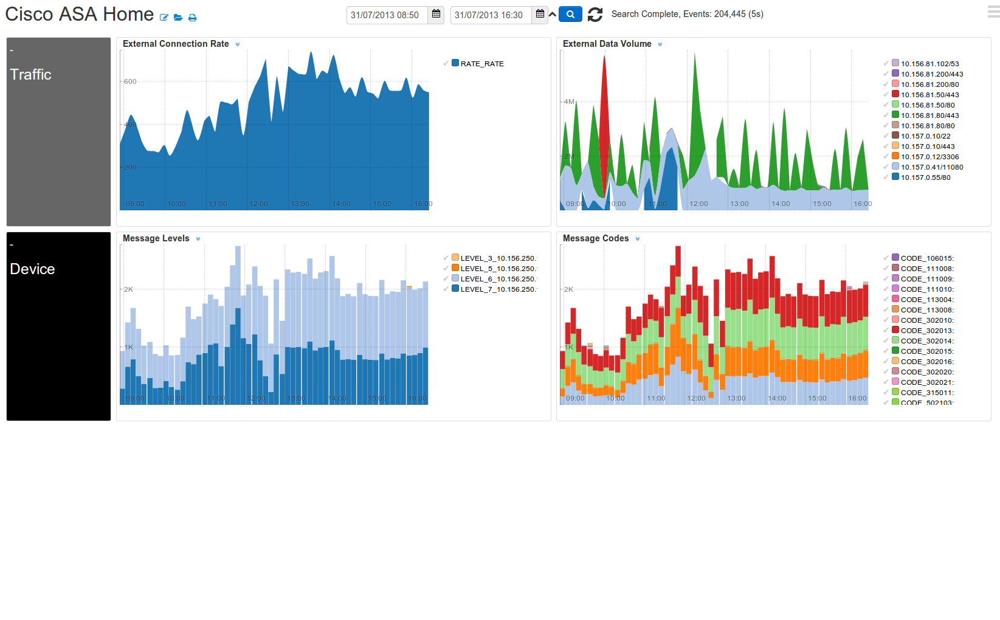

# CiscoApp-1.0 

Monitor CiscoASA, PIX devices 

	 

## Installation

1. To monitor CiscoASA devices point your devices to the Logscape's Syslog Server

	tcp MANAGER:1468,
	udp MANAGER:1516 

2. Import the CiscoSyslog.config file

3.  Update the CiscoASA datatype to match the names of your device's host. 

	

4.  If your logs get deleted off your Cisco Device Logscape will have retain a local copy.

