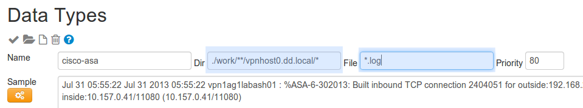
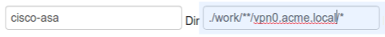
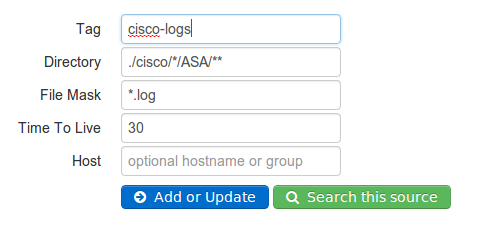
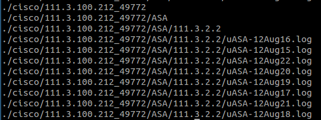
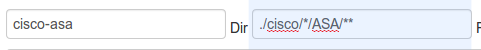

# CiscoApp-1.0 

Monitor CiscoASA, PIX devices 

## Overview 

 

## Installation

### Syslog Server 
The Logscape Manager runs a Syslog server on these ports 

	tcp MANAGER:1468
	udp MANAGER:1514

Set up your Cisco ASA device to the Logscape Syslog Server. 
Logscape Syslog Server will collect and store your Cisco data in the following location

	$LOGSCAPE_HOME/work/Syslog_Server/device.hostname.local/*

In the next step you will need to update your CiscoASA datatype. By default it will try and assign the cisco-asa datatype to any log in the syslog server folder. 
You will need update the cisco-asa datatype by updating the Dir to match the host forwarding your Cisco Syslog data. 

	 

 For example if your Cisco device sits on vpn0.acme.local then you update your Datatype to. i
	

 To match a group of host that have a similar name structure:

 * vpn0.acme.local
 * vpn1.acme.local
 * vpn2.acme.local 

You would use the following Dir setting

	./work/**/vpn*.acme.local/* 

### Using a  Data Source 

If your data is in a file location you can create a datasource

This will pull in all the log files from the asa folder

The last step is updating your datatype to reflect your data

 )

